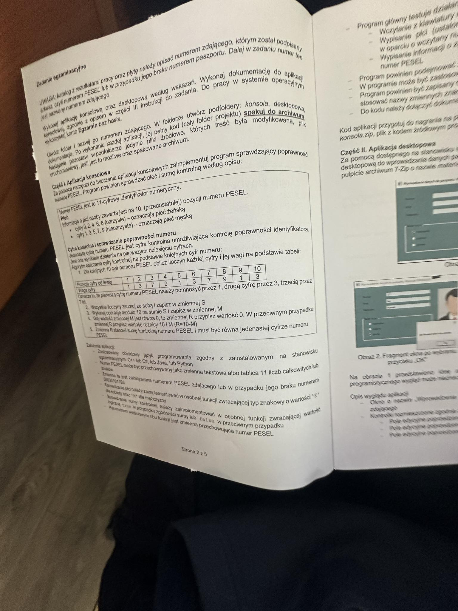
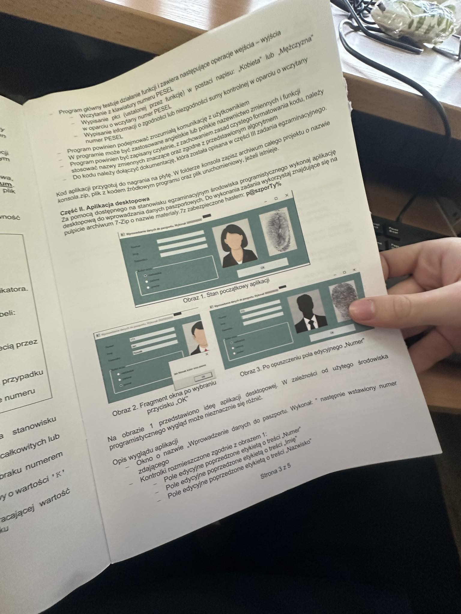

# pesel-validator

A simple program for validating your PESEL number and also checking the sex encoded inside. It's based on the first task of the 2024 January INF.04 Exam. The instruction is given below.

